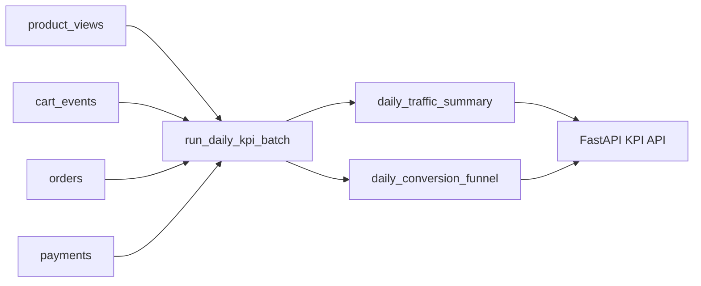
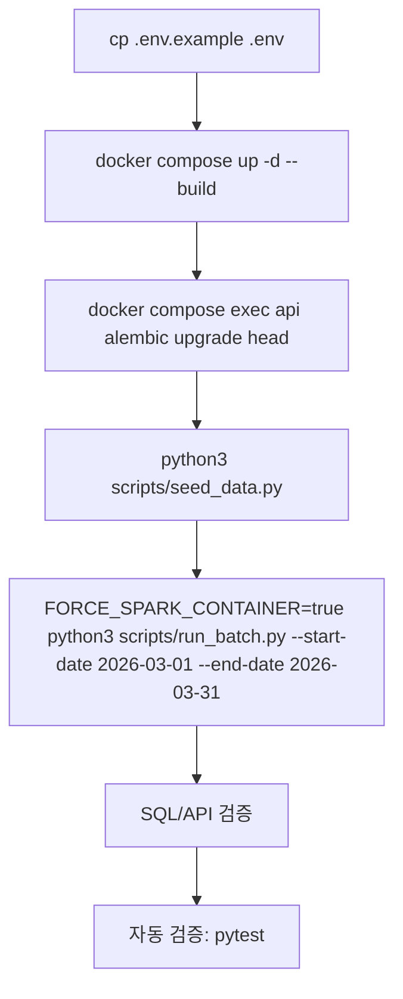

# 시스템 구조

이 프로젝트는 이커머스 KPI 지표를 산출하기 위한 엔드투엔드 데이터 파이프라인으로 구성되어 있습니다. 전체 시스템은 Docker Compose를 통해 관리되며, 다음과 같은 주요 서비스들로 이루어집니다:

- **postgres**: 시스템의 메인 데이터베이스입니다. 사용자 행동 로그와 같은 원천 데이터(Raw Data)와 Spark를 통해 집계된 KPI 요약 데이터를 저장합니다.
- **api**: FastAPI 기반의 웹 서버입니다. 데이터베이스에 저장된 KPI 데이터를 조회하는 API 엔드포인트를 제공하며, 데이터베이스 마이그레이션 및 초기 설정 작업을 수행합니다.
- **spark**: PySpark를 사용하는 배치 처리 엔진입니다. 데이터베이스의 원천 데이터를 읽어 일별 트래픽 및 전환 퍼널(Conversion Funnel) 지표를 계산한 후 다시 데이터베이스에 저장합니다.

## 폴더 역할

프로젝트의 주요 디렉토리 구조와 각 폴더의 역할은 다음과 같습니다:

- **app/**: 애플리케이션의 핵심 소스 코드가 위치합니다.
    - `api/`: FastAPI 엔드포인트 및 비즈니스 로직을 포함합니다.
    - `batch/`: Spark를 이용한 데이터 집계 및 배치 처리 로직이 구현되어 있습니다.
    - `db/`: SQLAlchemy 모델 정의 및 데이터베이스 연결 설정을 담당합니다.
    - `core/`: 환경 설정 및 공통 유틸리티 코드가 포함됩니다.
- **scripts/**: 시스템 운영 및 관리를 위한 스크립트 모음입니다. 데이터 시딩(`seed_data.py`)과 배치 실행(`run_batch.py`) 스크립트가 포함됩니다.
- **docs/**: 운영/구조 문서가 위치합니다. 3월 데이터 가정 및 이벤트/리텐션 해석은 `scenario-analysis.md`를 참고합니다.
- **data/**: 로컬/개발 검증용 결정론적 JSON 시드 데이터(`products.json`, `product_views.json`, `cart_events.json`, `orders.json`, `payments.json`)를 보관합니다.
- **tests/**: 시스템의 기능 및 데이터 정합성을 검증하기 위한 Pytest 기반의 테스트 코드가 포함됩니다.
- **alembic/**: 데이터베이스 스키마의 버전 관리 및 마이그레이션을 위한 이력 파일들이 저장됩니다.

## 데이터 흐름

이 저장소의 데이터 흐름은 원천 이벤트 적재 → 일 단위 배치 집계 → 요약 테이블 조회로 이어집니다. 먼저 사용자 행동 원천 데이터가 `product_views`, `cart_events`, `orders`, `payments` 테이블에 저장됩니다. 이후 `run_daily_kpi_batch`가 지정된 날짜 구간의 데이터를 읽어 사용자 기준(일자 + user_id)으로 중복을 제거하고, 퍼널 순서를 반영해 일별 KPI를 계산합니다.

집계 결과는 두 개의 요약 테이블에 기록됩니다. 트래픽 요약은 `daily_traffic_summary`에 저장되고, 전환 퍼널 지표는 `daily_conversion_funnel`에 저장됩니다. 배치는 해당 날짜 범위의 기존 요약 행을 삭제한 뒤 동일 범위를 다시 적재하는 방식으로 동작합니다.

읽기 경로는 요약 테이블 중심입니다. API는 `daily_traffic_summary`와 `daily_conversion_funnel`의 집계 결과를 조회해 KPI 응답을 제공합니다.

`daily_conversion_funnel`의 네 가지 Funnel Conversion Rate 의미는 다음과 같습니다.
- `cart_from_view_rate`: 같은 일자 기준으로 view 사용자 중 cart 단계까지 도달한 사용자 비율
- `order_from_cart_rate`: 같은 일자 기준으로 cart 사용자 중 order 단계까지 도달한 사용자 비율
- `payment_from_order_rate`: 같은 일자 기준으로 order 사용자 중 완료 결제(payment_status='completed')까지 도달한 사용자 비율
- `payment_from_view_rate`: 같은 일자 기준으로 view 사용자 중 최종 완료 결제까지 도달한 사용자의 전체 전환 비율

## 실행 흐름

실행은 환경 준비 → 서비스 부팅 → 스키마/권한 초기화 → 데이터 적재 → 배치 집계 순서로 진행합니다. 사용자 실행 관점의 전체 명령은 [README 런북](../README.md)에 0~10 단계로 정리되어 있으며, 아래는 시스템 관점의 핵심 흐름입니다.

1. `.env` 준비
   - `.env.example`을 복사해 실행 환경 변수를 확정합니다.
   - 명령: `cp .env.example .env`
2. Docker 서비스 부팅
   - `postgres`, `api`, `spark`를 함께 시작합니다.
   - 명령: `docker compose up -d --build`
3. 데이터베이스 마이그레이션
   - API 컨테이너에서 Alembic 마이그레이션을 적용해 스키마를 최신 상태로 맞춥니다.
   - 명령: `docker compose exec api alembic upgrade head`
4. 결정론적 시드 데이터 적재
   - `data/`의 원시 이벤트 샘플을 PostgreSQL 원시 테이블에 적재합니다.
   - 명령: `python3 scripts/seed_data.py`
5. Spark 배치 집계 실행
   - 지정한 날짜 범위를 대상으로 KPI 요약 테이블을 재계산합니다.
   - 명령: `FORCE_SPARK_CONTAINER=true python3 scripts/run_batch.py --start-date 2026-03-01 --end-date 2026-03-31`

`scripts/run_batch.py`는 로컬 Java 런타임이 없거나 `FORCE_SPARK_CONTAINER=true`일 때 `docker compose run --rm spark ...` 경로로 실행되므로, 로컬/컨테이너 환경 모두 동일한 배치 진입점을 사용합니다.

## 검증 흐름

검증은 수동 확인(SQL/API)과 자동 확인(pytest)으로 수행합니다.

1. SQL 검증 (요약 테이블 정합성)
   - 트래픽/퍼널 요약 테이블의 날짜별 집계가 생성되었는지 직접 조회합니다.
   - 예시:
     - `docker compose exec postgres psql -U postgres -c "SELECT * FROM daily_traffic_summary ORDER BY summary_date ASC;"`
     - `docker compose exec postgres psql -U postgres -c "SELECT summary_date, view_users, cart_users, order_users, payment_users FROM daily_conversion_funnel ORDER BY summary_date ASC;"`
2. API 검증 (읽기 경로 확인)
   - FastAPI KPI 엔드포인트가 요약 결과를 정상 반환하는지 확인합니다.
   - 예시:
     - `curl -s "http://localhost:8000/kpi/traffic/daily?summary_date=2026-03-01" | jq .`
      - `curl -s "http://localhost:8000/kpi/funnel/range?start_date=2026-03-01&end_date=2026-03-31" | jq .`
3. 자동 검증
   - 테스트 스위트를 실행해 회귀 여부를 확인합니다.
   - 명령:
      - `FORCE_SPARK_CONTAINER=true python3 -m pytest -q`

운영자가 단일 절차를 따라 실행할 때는 [README 런북](../README.md)을 기준으로 진행하고, 이 섹션은 각 검증 단계가 왜 필요한지와 시스템 관점의 확인 포인트를 설명합니다.

## 문서 범위와 제외 대상

이 한국어 문서화 작업의 범위는 사용자 대상의 Markdown 문서로 한정됩니다. 다음 항목들은 번역 대상에서 제외되며, 원문 그대로 유지됩니다:

- `.sisyphus/**`: 프로젝트 오케스트레이션 및 관리용 아티팩트
- 설정 파일 및 코드: `docker-compose.yml`, `app/**/*.py`, `scripts/**/*.py`, `tests/**/*.py`
이러한 실행 환경 관련 파일, 설정, 소스 코드는 시스템의 무결성을 유지하기 위해 번역하지 않습니다.
